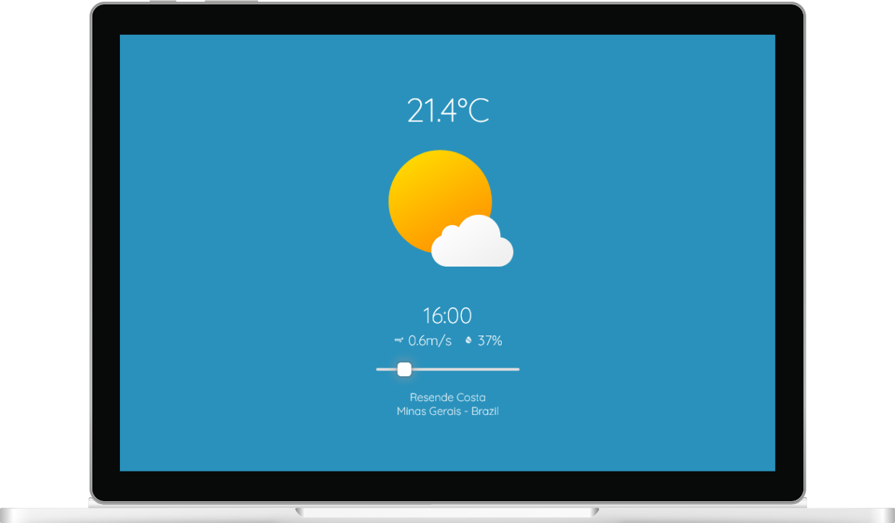
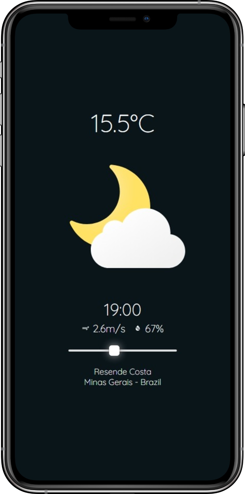

<br/><br/>

<p align=center>
    
</p>

<h1 align=center>SWeather</h1>

<br/>
<p align=center>
    <a href='https://gabriel-dp.github.io/SWeather/'>gabriel-dp.github.io/SWeather/</a>
    <br/><br/>
    
    &nbsp;
    
    &nbsp;
    
    &nbsp;
    
</p>

&nbsp;

<p align=center>
    
    &nbsp;&nbsp;&nbsp;&nbsp;
    
</p>

&nbsp;

## 💡 Motivation

The name "SWeather" comes from "Styled Weather" and represents the idea of creating an alternative way to show the weather forecast, being special to the user experience.

With smooth transitions and animations that vary according to the weather, the app is very intuitive, making it possible to navigate between time intervals from the past to the future.

Try it yourself!

&nbsp;

## ⚙️ API

The project uses data from Tomorrow.io, a great and free Weather API.


> [Access the official website](https://www.tomorrow.io)

&nbsp;

## 🖥️ Running locally

```bash
# Clone repository
git clone https://gabriel-dp.github.io/SWeather/.git

# Install node modules
npm install

# Run local server
npm run dev
```
